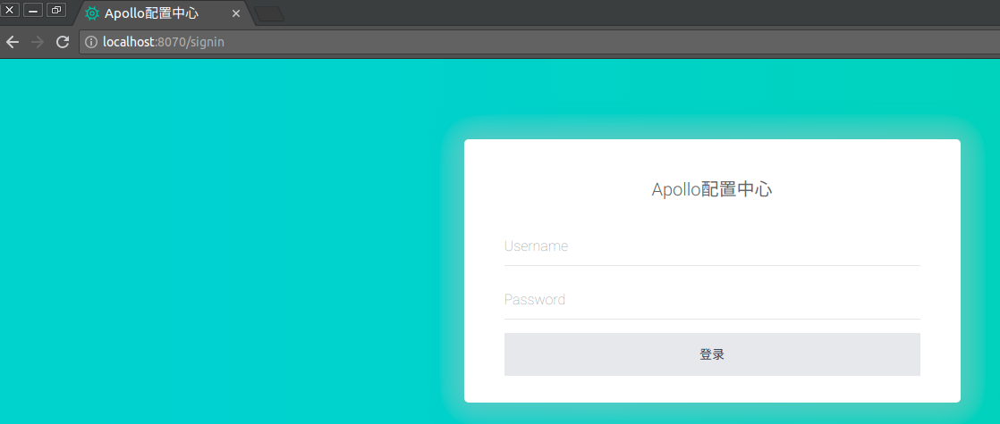
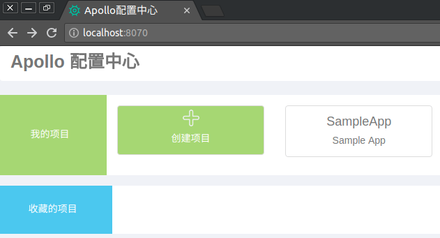
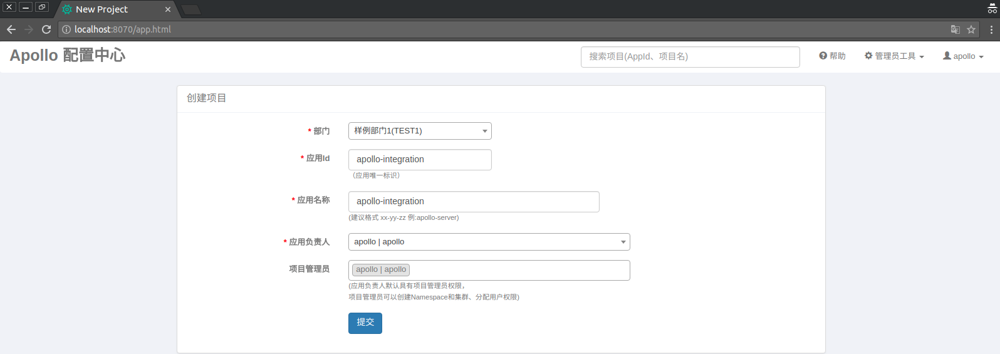
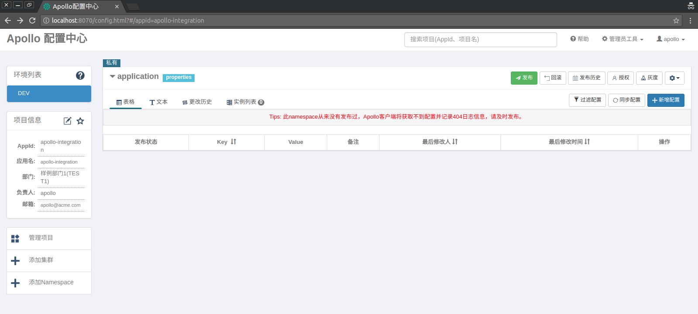
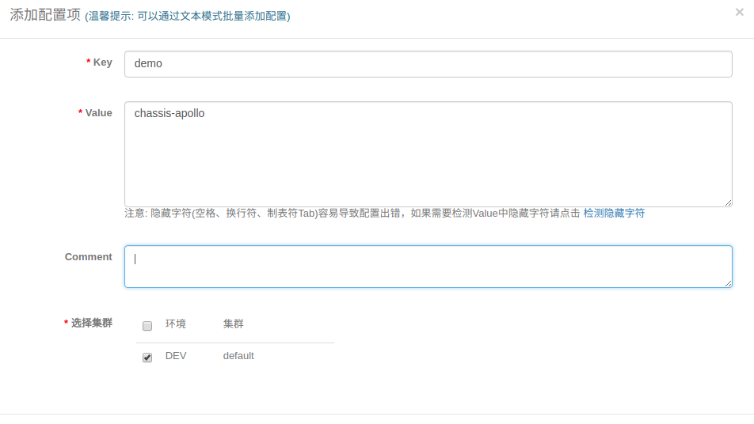
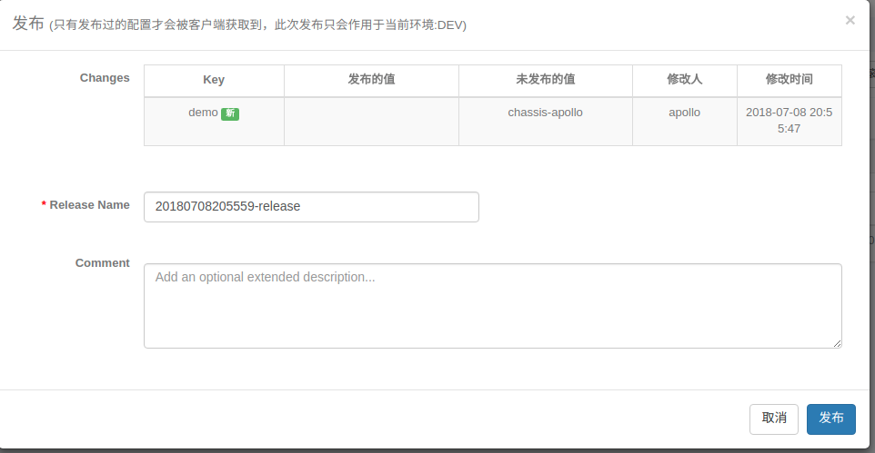

# Chassis-Apollo Example

This is a example illustrates the integration of go-chassis with Ctrip Apollo Configuration Center.

### Objective
This examples showcases the following things:
1. Start Ctrip Apollo and make Projects, NameSpace and Configurations.
2. Configure chassis.yaml to use Apollo Configuration Server.
3. Use Apollo to dynamically change configurations of chassis.
4. Configure the QPS limit for microservices by using Apollo.


#### Quick start Apollo

Easiest way to bring up Apollo configuration is using docker compose.

```go
git clone https://github.com/ctripcorp/apollo $GOPATH/src/github.com/ctripcorp/apollo

cd $GOPATH/src/github.com/ctripcorp/apollo/scripts/docker-quick-start

docker-compose up
```
This brings up the Apollo, follow the below steps to configure the project and namespace.

- Login to Apollo 
  
By default the credentials is user is apollo/admin  
- Create a new Project  
  
Create a new project called ***apollo-integration*** which we will use through out this example.  
  
- Note all the details regarding Project Name, AppID, NameSpace, ClusterName.  
  
- Add a new Configurations  
  
Once config is added you need to release the config so that it will be available to outside components.  
  
  
#### Configure the chassis.yaml
You need to configure the chassis.yaml for both the client and server to use Apollo as the configurations server. (By default we have added these configurations to this example in client and server).
```go
cse:
  config:
    client:
      serverUri: http://127.0.0.1:8080          # This should be the address of your Apollo Server
      type: apollo                              # The type should be Apollo
      refreshMode: 1                            # Refresh Mode should be 1 so that Chassis-pulls the Configuration periodically
      refreshInterval: 10                       # Chassis retrives the configurations from Apollo at this interval
      serviceName: apollo-integration           # This the name of the project in Apollo Server
      env: DEV                                  # This is the name of environment to which configurations belong in Apollo
      cluster: apollo                           # This is the name of cluster to which your Project belongs in Apollo
      namespace: application                    # This is the NameSpace to which your configurations belong in the project.
```

#### Running the Client and Server 
Client and Server in this example can be run on the same machine
- Start the Service-Center
```go
docker run -d -p 30100:30100 servicecomb/service-center
```  
- Get Chassis
```go
go get github.com/ServiceComb/go-chassis
```
- Start the Client
```go
cd client
go build
./client
```
- Start the Server
```go
cd server
go build
./server
```
- Verify the Communication between client and server
```go
$ curl -v http://127.0.0.1:8085/greet/asif
*   Trying 127.0.0.1...
* TCP_NODELAY set
* Connected to 127.0.0.1 (127.0.0.1) port 8085 (#0)
> GET /greet/asif HTTP/1.1
> Host: 127.0.0.1:8085
> User-Agent: curl/7.58.0
> Accept: */*
> 
< HTTP/1.1 200 OK
< Date: Sun, 08 Jul 2018 15:45:41 GMT
< Content-Length: 30
< Content-Type: text/plain; charset=utf-8
< 
* Connection #0 to host 127.0.0.1 left intact
user user asif from 95 from 62
```

#### Change the Configurations of Chassis dynamically using Apollo

##### QPS Limit
- Test the QPS using AB tool without setting any QPS limit(don't judge this data for the performance of any component)  
```go
$ ab -n 1000 -c 1 http://127.0.0.1:8085/greet/asif
This is ApacheBench, Version 2.3 <$Revision: 1807734 $>
Copyright 1996 Adam Twiss, Zeus Technology Ltd, http://www.zeustech.net/
Licensed to The Apache Software Foundation, http://www.apache.org/

Benchmarking 127.0.0.1 (be patient)
Completed 100 requests
Completed 200 requests
Completed 300 requests
Completed 400 requests
Completed 500 requests
Completed 600 requests
Completed 700 requests
Completed 800 requests
Completed 900 requests
Completed 1000 requests
Finished 1000 requests


Server Software:        
Server Hostname:        127.0.0.1
Server Port:            8085

Document Path:          /greet/asif
Document Length:        30 bytes

Concurrency Level:      1
Time taken for tests:   1.187 seconds
Complete requests:      1000
Failed requests:        0
Total transferred:      147000 bytes
HTML transferred:       30000 bytes
Requests per second:    842.60 [#/sec] (mean)
Time per request:       1.187 [ms] (mean)
Time per request:       1.187 [ms] (mean, across all concurrent requests)
Transfer rate:          120.96 [Kbytes/sec] received
```  
The current QPS is 842.  
- Now let's set the QPS to 100 dynamically using Apollo.

Go to ***apollo-integration*** project and add a new configuration in ***application*** namespace.  
  
Release this configuration.  
Now using the same ab tool to benchmark the api.
```go
$ ab -n 1000 -c 1 http://127.0.0.1:8085/greet/asif
This is ApacheBench, Version 2.3 <$Revision: 1807734 $>
Copyright 1996 Adam Twiss, Zeus Technology Ltd, http://www.zeustech.net/
Licensed to The Apache Software Foundation, http://www.apache.org/

Benchmarking 127.0.0.1 (be patient)
Completed 100 requests
Completed 200 requests
Completed 300 requests
Completed 400 requests
Completed 500 requests
Completed 600 requests
Completed 700 requests
Completed 800 requests
Completed 900 requests
Completed 1000 requests
Finished 1000 requests


Server Software:        
Server Hostname:        127.0.0.1
Server Port:            8085

Document Path:          /greet/asif
Document Length:        30 bytes

Concurrency Level:      1
Time taken for tests:   9.891 seconds
Complete requests:      1000
Failed requests:        0
Total transferred:      147000 bytes
HTML transferred:       30000 bytes
Requests per second:    101.10 [#/sec] (mean)
Time per request:       9.891 [ms] (mean)
Time per request:       9.891 [ms] (mean, across all concurrent requests)
Transfer rate:          14.51 [Kbytes/sec] received

```  
Now you can see the QPS is 101, so here we were able to change the configuration of your microservices dynamically without restarting or changing anything in your microservice. ***Awesome***


